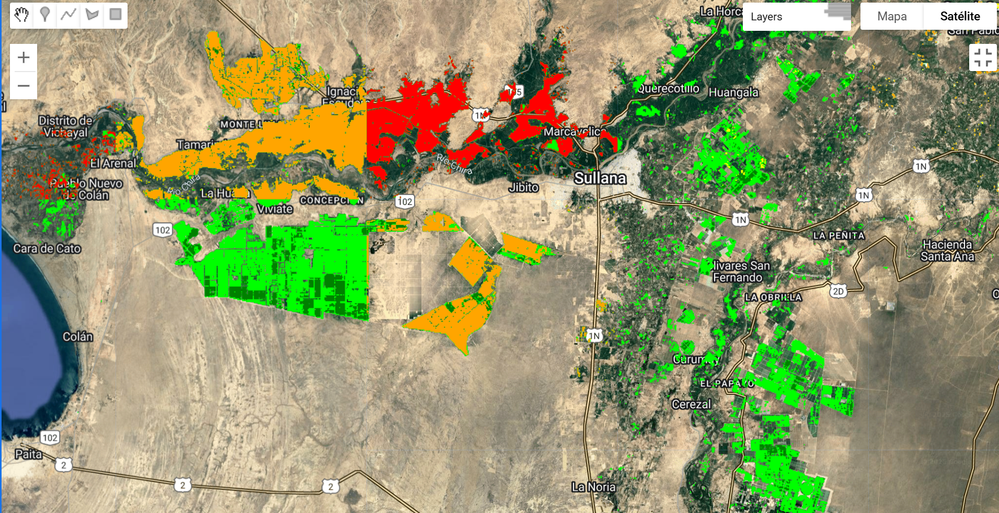

# SequiaAlphaEarth
Proyecto académico desarrollado con Google Earth Engine para la recomendación de parcelas agrícolas en Piura, utilizando AlphaEarth, con el objetivo de reducir el impacto de la sequía. 

### 📌 Contexto del Problema
La región de Piura es altamente vulnerable a eventos de sequía, los cuales afectan directamente la productividad agrícola y la seguridad alimentaria.  

### 📝 Proceso 
-Procesamiento de imagenes satelitales del dataset FAO GAUL 2024.
-Cálculo del índice de vegetación  NDVI para evaluar el estado de la cobertura vegetal. 
-Detección de Sequía en base al NDVI Histórico
-Clasificación de Parcelas con estrés hídrico
-Recomendación de Parcelas Agricolas con AlphaEarth

### 🌍 Fuente de datos utilizados
-Sentinel-2: Permite calcular el indice de vegetación diferencia normalizada (NDVI)
-ESA World Cover 2021: Se utiliza para identificar y enmascarar exclusivamente áreas agricolas.
-FAO GAUL 2024: Proporciona los limites administrativos necesarios para delimitar la región de Piura.
-AlphaEarth Embeddings: Facilita la recomendación de parcelas agricolas. 

#Imagenes  de capas de GEE
#Naranja: Zonas con Sequía.
#Rojo:    Zonas con estrés hídrico.
#Verde:   Parcelas saludables

#Imagenes de Recomendación de Parcelas en buen estado 

